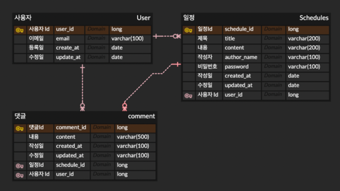

# API 명세서
https://held-gas-bf2.notion.site/API-1c0a43069a5580938d9efa5b21c14664?pvs=4

# ERD

# 예외처리
- @valid와 @NotNull, @NotBlank를 통해 필수 요청 값에 대한 null 검증 
- @valid와 @Size(max = 200)를 통해 할일이 최대 200자를 초과하는지 검증
- 요청 파라미터 타입 검증
  - {
    "code": 2001,
    "status": 400,
    "message": "잘못된 파라미터 타입입니다."
    }
- 일정 생성 시 userId 값 받을 때 존재하지 않는 사용자인지 검증
  - {
    "code": 3001,
    "status": 400,
    "message": "존재하지 않는 사용자입니다."
    }
- 일정 상세 조회, 수정, 삭제 시 존재하지 않는 일정인지 검증
  - {
    "code": 4001,
    "status": 400,
    "message": "일정이 존재하지 않습니다."
    }
- 일정 수정, 삭제 시 비밀번호 일치하는지 검증
  - {
    "code": 4002,
    "status": 400,
    "message": "비밀번호가 일치하지 않습니다."
    }
